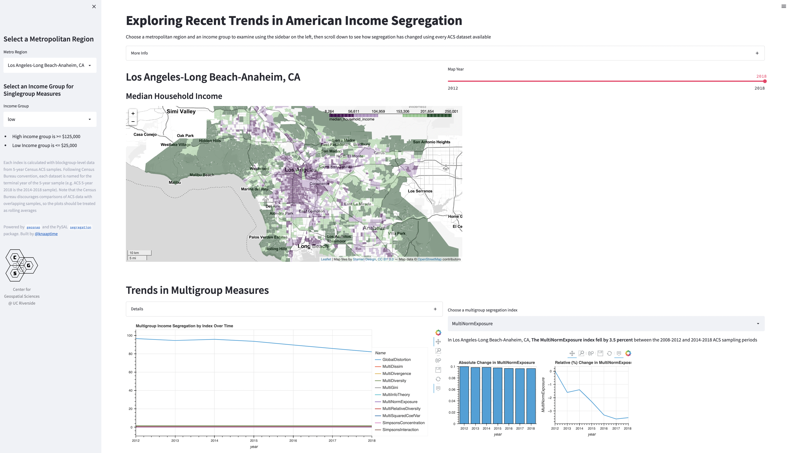

# Exploring Trends in American Income Segregation

A simple streamlit app powered by `geosnap` and `segregation` for exploring income segregation




## Setup

with anaconda (preferably the mambaforge version), run

`mamba env create -f environment.yml`

## Run

clone this repo, then inside the directory run

```bash
conda activate ingseg      # activate the environment
streamlit run app.py       # start the app
```

If the dashboard runs slowly, it's probably streaming data over the web. You should be able to speed it up by first using [geosnap](https://github.com/spatialucr/geosnap) to [download](https://spatialucr.github.io/geosnap/generated/geosnap.io.store_acs.html#geosnap.io.store_acs) the 2018 ACS data, then relaunching the streamlit app.

